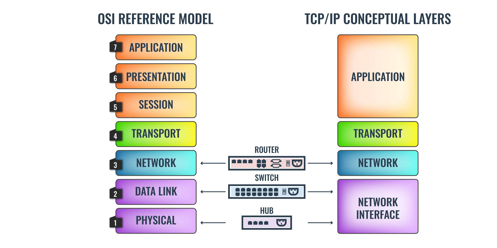

### Open System Interconnection MODEL

-

## Layers in OSI Model

### Application Layer

> As mentioned above, the Application layer is the one that the user actually interacts with.
> Whenever you’re interacting with an application on your computer you’re active on the
> Application layer. For example, if you use Google Chrome or Skype then you’re
> interacting with an application at _Layer 7_. This layer utilizes protocols like **HTTP**,
> **Telnet**, and **FTP**. In a nutshell, this layer is focused on end-user processes
> and delivering any application the user wants to access.

### Presentation Layer

> The Presentation Layer or Layer 6 of the OSI model is designed to prepare and translate data
> from the network format to the application format or vice versa. This layer determines how
> data is presented for each of these entities in terms of syntax and structure. In many cases,
> the Presentation Layer can be seen through the encryption and decryption of data. Other
> examples include ASCII, TIFF, JPEG, GIF, ESBCDIC, PICT, JPEG, MPEG, and MIDI.

### Session Layer

> Layer 5 of the OSI model is referred to as the Session Layer. The Session Layer is the
> layer responsible for establishing, maintaining, and ending connections between different
> applications. This layer controls the terms on which applications interact with each other.
> A key part of this is simple coordination, as the Session Layer will dictate how long a
> system will wait for a response from another application. Typically you’ll see protocols
> such as NetBios, NFS, RPC, and SQL operating on this layer.

### Transport Layer

> The Transport Layer is one of the most well-known OSI layers of the OSI model as it is
> the layer responsible for transferring data between end systems and hosts. It dictates
> what gets sent where, and how much of it gets sent. At this level, you see protocols
> like TCP, UDP, and SPX. In the event that something goes wrong, the Transport Layer
> also has the responsibility of end-to-end error recovery.

### Network Layer

> The Network Layer of the OSI model has the job of dealing with most of the routing within
> a network. This layer deals with packet forwarding and sets the route that packets travel
> through a network. In simpler terms, the Network Layer determines how a packet travels to
> its destination. Protocols like TCP/IP, AppleTalk, and IPX operate at this layer.

### Data Link Layer

> At Layer 2 of the OSI model, you have the Data Link Layer. The Data Link Layer handles
> node-to-node data transfers and can be divided into sublayers; The Media Access Control(MAC)
> Layer and Logical Link Control (LLC) Layer. The MAC Layer determines how a connected computer
> accesses data in terms of permissions. On the other hand, the LLC layer controls elements like
> flow control, frame synchronization, and scans for errors. Switches work at this layer.

### Physical Layer

> At Layer 1 we have the Physical Layer. The Physical Layer is the hardware layer of the
> OSI model which includes network elements such as hubs, cables, ethernet, and repeaters.
> For example, this layer is responsible for executing electrical signal changes like making
> lights light up. At this layer, you will encounter Ethernet, RS232, ATM, and FDDI. Most of
> the time administrators use the Physical Layer to check that cables and devices are connected
> correctly.
